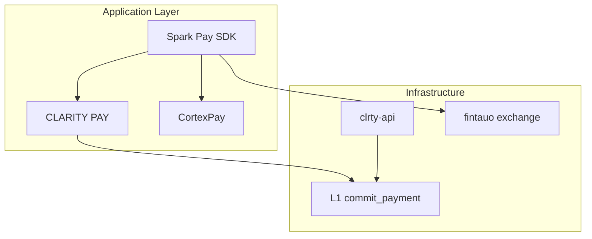

# Spark Pay overview

**Clarity Spark Pay** = universal payment layer for CLRTY-1 and cross-chain stable routing.

Inspired by Solana Pay, expanded with:

- **URL-based payments** — `claritypay://` + HTTPS QR URLs
- **Wallet-native init** — 10-step local session (no account)
- **No-KYC optimized off-ramp** — P2P + stablecoin-first, partner rails optional
- **Institutional API** — webhooks, batch payroll, enterprise payouts

## System placement

## Core features

| Feature | Description |
|---------|-------------|
| Transfer request | Simple direct payment — no backend |
| Transaction request | Dynamic tx via merchant callback API |
| Off-ramp paths | P2P, stable, DEX aggregate, card, bank, mobile |
| FX conversion | Token → stable → fiat with oracle + lock |
| QR / embed | Spark Pay URL generator + checkout buttons |

## Related CLRTY surfaces

- [7 RPC Gate system](../../public/architecture/realms.md) — sequential gated access
- [Inner Store / private ecosystem](../../public/architecture/inner-store.md)
- [CLRTY Nano + Lens](../../public/architecture/realms.md) — prompt overlay during wallet init
- [Exchange / sell flow](https://exchange.clarity-fintech.com/sell) — fiat off-ramp UI

## SDK

Package: `@clarity/spark-pay` — [clarity-fintech/clarity_spark](https://github.com/clarity-fintech/clarity_spark)

Monorepo path: `packages/clarity_spark/`

Live URLs: [spark.clarity-fintech.com](https://spark.clarity-fintech.com) · [pay.clarity-fintech.com](https://pay.clarity-fintech.com)

Deploy: `make spark-pay-1501-1600` · `make spark-pay-1601-2600`

See [Merchant UI](spark-merchant-ui.md) · [Command matrix](spark-command-matrix.md)
