# Whitepaper Volume III — Institutional Readiness

Volume III Institutional Readiness PDF Export Edition CLRTY Whitepaper Volume III Institutional Readiness, Evidence Architecture, Exchange Submission Support, and Operational Hardening Prepared from the uploaded CLRTY addendum, public CLRTY website positioning, public GitHub repositories and user-supplied institutional due-diligence requirements.

Date: 2026-07-04.

16M Fixed token hard cap referenced in public materials 100 Granular readiness tasks consolidated in this volume 10 Exchange- readiness control pillars reflected from public checklist 6 Public CLRTY repos translated into diligence controls This document is a standalone institutional volume designed for exchanges, security reviewers, market makers, legal/compliance teams, treasury counterparties, and sophisticated investors.

It is intentionally separate from the previously uploaded security/ governance addendum and avoids duplicating its baseline control narrative.

Instead, it converts the wider CLRTY toolchain, public security artifacts, and institutional diligence expectations into a reviewer-friendly readiness architecture.

Important posture: verified public artifacts are separated from planned or recommended future artifacts.

No external audit report link or public production block explorer URL was verified in the reviewed source set at the time of preparation.

1 Table of Contents 1.

Executive Summary 2.

Reader Guide and Document Boundary 3.

Methodology and Evidence Posture 4.

Why Volume III Exists Separately 5.

Institutional Due Diligence Lens 6.

CLRTY Operating System and Ecosystem Map 7.

Repo-to-Control Mapping 8.

Institutional Security Program 9.

Exchange-Readiness Operating Model 10.

Market Structure and T oken Control Formalization 11.

Operational Readiness and Data Room Architecture 12.

T estnet and Mainnet Readiness Playbook 13.

Reviewer Workflow and Submission Governance 14.

CertiK and Third-Party Review Preparation 15.

Listing Questionnaire Answer Bank 16.

Full 100-T ask Build, T est, Validation and Exchange-Push Matrix 17.

Risks, Pending Evidence and No-Overclaim Statement 18.

Conclusion Appendix A.

Status Definitions Appendix B.

Source URL Register 2 Executive Summary Volume III exists to convert CLRTY from a high-concept token and infrastructure narrative into a due-diligence-ready operating package.

The uploaded addendum already covers foundational governance architecture, time-locks, multisig pathways, progressive decentralization, supply bounds, and a broad control framework.

This volume therefore takes the next step: it maps real public artifacts, identifies evidence gaps honestly, and translates the wider CLRTY operating system into the vocabulary used by exchange committees, institutional investors, market makers, security assessors, and audit teams.

Public materials portray CLRTY as a sovereign L1 framing around clrty-1, a fixed 16 million cap, HELIX private execution, AI allocation routing, and a coordination-layer thesis that emphasizes deterministic finality and operational discipline rather than launch-week speculation.

The public website, strategy page, PRISM CLI references, security repository, node tooling, developer kit, wallet integration kit, and research kit collectively describe a broader system rather than a single token contract.

That distinction matters for due diligence because institutional reviewers evaluate not only the asset, but also the issuance path, operator controls, partner surfaces, incident process, exchange integration procedures, and post-listing governance.

This volume therefore organizes the CLRTY ecosystem into evidence categories.

It clarifies what is already publicly evidenced, what appears designed but still needs attached proof, and what can only be represented after outside attestation by auditors, counsel, market makers, custody providers, or exchanges.

It also provides practical deliverables: a listing questionnaire answer bank, CertiK-ready contextual language, a virtual data room blueprint, and a complete 100-task build/test/exchange-push matrix covering source code, chain readiness, compliance, liquidity, continuity, and long-term operations.

Evidenced now: a public security policy and disclosure process, public chain-stress evidence for local/simulated tests, public readiness checklist categories, public repository surfaces for PRISM CLI, wallet integration, research kit, node deployment, and developer tooling.

Required next: external audit linkage, verified public block explorer references, live- endpoint throughput evidence, formal legal opinions, and any reviewer-specific NDA data-room materials that cannot yet be claimed from public sources.

Reader Guide and Document Boundary This document should be read as an institutional operations volume, not as a substitute for legal advice, a final smart-contract audit, a production service-level agreement, or a 3 securities-law opinion.

It is intentionally bounded.

It does not attempt to restate every mechanism from the prior addendum; it assumes the reader can consult that prior volume for foundational governance and token-control description.

Instead, Volume III answers a different question: what evidence architecture would make CLRTY legible to institutions deciding whether to list, integrate, trade, support, or diligence the system?

Accordingly, the document uses three labels throughout.

“Evidenced Now” denotes facts that appear in reviewed public materials.

“Planned/Internal” denotes controls that may be described or implied, but were not accompanied by sufficient public proof to claim as complete.

“Required Next” denotes artifacts that an institutional process will likely insist upon before launch, listing, custody, significant liquidity support, or investment committee approval.

This triage approach is essential in digital asset diligence because the most common failure is not the absence of ambition; it is the confusion between an intended control and a proven control.

The document also deliberately treats CLRTY as a multi-surface ecosystem: the native asset model, chain layer, CLI, wallets, node operations, developer APIs, research/ simulation artifacts, and security governance.

Exchanges and counterparties do not review these in isolation.

Their real question is whether the whole environment can absorb failure without collapsing into ad hoc founder discretion.

Every chapter in Volume III is therefore aimed at institutionalizing that answer.

Methodology and Evidence Posture The core source base consisted of the uploaded PDF addendum, the public CLRTY website, the public early investment access page, the public CLRTY strategy Notion page, and the public GitHub repositories referenced by the user.

Several Notion pages were not fully retrievable as public webpages, so any content from those pages is either used only when reflected elsewhere in public pages or treated as user-supplied planning context rather than directly verified public evidence.

The security repository and associated documents provided the strongest concrete public evidence for institutional readiness because they exposed named policy pages, reporting scopes, response targets, and readiness registers.

This volume also incorporates the user-supplied due-diligence framework covering operational due diligence, technical due diligence, AML/KYC expectations, sanctions controls, the virtual data room checklist, and exchange-onboarding concerns.

Those materials are not treated as automatically true statements about CLRTY .

Instead, they are used as a standard against which CLRTY deliverables should be measured.

In other words, Volume III does not merely summarize CLRTY; it crosswalks CLRTY against the institutional examination it is likely to face.

Where the public record did not support a claim, the claim was not made.

This is especially important for external audits, bug bounty economics, explorer references, and live mainnet performance.

For example, the public security policy confirms a coordinated 4 vulnerability disclosure program and lists a security contact, but it also states that paid bug bounty rewards are discretionary until a formal schedule is published.

Likewise, the CLRTY-1 live chain stress report publicly supports local/simulated battery results, but it explicitly warns that no hosted public endpoint pressure test was run because no configured live endpoint was present.

Those distinctions are preserved throughout this volume.

Why Volume III Exists Separately The prior addendum already functions as a governance and control-framework memo.

It reportedly contains sixteen sections spanning executive framing, governance architecture, emergency pathways, progressive decentralization, a technical control framework, implementation sequencing, and exchange-compliance readiness.

Reprinting those sections would inflate page count without adding decision-useful clarity for a reviewer.

Volume III therefore exists to handle the layers that institutions care about after a baseline control design has been understood: evidence, process, interfaces, packaging, and truth-in-claims discipline.

Put differently, the prior addendum explains the skeleton; Volume III describes the connective tissue.

Institutions ask who owns the release branch, how reviewers privately report vulnerabilities, what evidence backs the chain claims, how wallets and nodes are onboarded, how a market maker receives instructions, which repo contains the canonical questionnaire answer, what happens if a signer disappears, and where a reviewer can locate the cleanest version of the truth.

Those are operational questions.

They cannot be answered by tokenomics rhetoric alone.

They require a volume whose main unit of analysis is the artifact, not the slogan.

Volume III also resolves another common diligence problem: fragmentation.

CLRTY is not presented publicly as a single code repository or landing page.

It is presented as a stack.

That is attractive from a product standpoint but risky from a review standpoint, because institutions worry that complexity masks unclear ownership boundaries.

A dedicated volume that maps repositories, documents, duties, evidence, and gaps reduces that risk materially.

Institutional Due Diligence Lens Institutional due diligence is best understood as a stress test of viability, security and ethics.

For CLRTY, that means the diligence perimeter extends beyond token issuance mechanics into ownership transparency, operational governance, technical resilience, compliance controls, key-person risk, treasury discipline and conflict management.

An exchange or sophisticated allocator will test whether CLRTY behaves more like a regulated financial technology operator than a narrative-stage crypto launch.

Operational due diligence asks whether the corporate and decision structure is defensible.

In CLRTY terms, that requires a clean mapping from entity control to signer 5 control, a traceable capitalization and allocation record, delegated authority rules for treasury and product changes, and board-or-equivalent documentation for material decisions.

T echnical due diligence asks whether the protocol can survive hostile conditions without silent trust assumptions.

In CLRTY terms, that means branch freezes, deterministic release evidence, chain stress packs, dependency auditability, API hardening, wallet flow reliability, signer-recovery procedures and post-incident traceability.

Compliance due diligence is not satisfied by a general statement that the token is a utility.

Reviewers will expect jurisdictional mapping, sanctions handling, customer screening logic where applicable, travel-rule readiness if VASP functions arise, data privacy treatment, and a legal memo aligned to the actual issuance and distribution structure.

Financial due diligence further requires treasury controls, reserve or proof-of- capital logic where represented, and reconciliations between toke

_…continued in source PDF._


<!-- clrty-blocks:v1 -->


**L2**

Institutional whitepaper volume — private diligence tier.


```diagram-panel
svg: 09-attestation-ledger.svg
caption: Attestation ledger
```


*Attestation ledger*
