# Realms (RPC capability layers)

| Realm | Purpose |
| --- | --- |
| Infrastructure | Routing, latency, node health |
| Data | Queries, flows, liquidity |
| Institutional | Cohorts, capital flows, protocol metrics |
| AI | Signals, prompt augmentation, context |
| Execution | Routing optimization, efficiency |
| Capital | MIRRA, liquidity, darkpool |
| Inner | Environment, strategy rooms |


<!-- clrty-blocks:v1 -->

```realm-map
title: Seven Realms
source: public architecture
```

| Realm | Purpose |
| --- | --- |
| Infrastructure | Routing, latency, node health |
| Data | Queries, flows, liquidity |
| Institutional | Cohorts, capital flows |
| AI | Signals, prompt augmentation |
| Execution | Routing optimization |
| Capital | MIRRA, liquidity, darkpool |
| Inner | Environment, strategy rooms |



Routing, latency, node health RPC surface.


Queries, flows, liquidity — public and institutional tiers.


Cohorts, capital flows, protocol metrics (gated).


Signals, prompt augmentation, agent context.


HELIX-aware routing, efficiency scoring.


MIRRA, liquidity, darkpool coordination.


Environment modules, strategy rooms.



```diagram-panel
svg: 23-fault-tolerant-mesh-topology.svg
caption: Fault-tolerant mesh topology
```


*Fault-tolerant mesh topology*
