# System model

```text
User → Gates → Routing Engine → Realms → Inner Companies → Environment
```

| Stage | Function |
| --- | --- |
| **Gates** | Sequential unlock — infra, data, context, AI, execution, capital, inner |
| **Routing** | Intent interpretation, fast-track, loopback, block rules |
| **Realms** | Domain-specific RPC/capability layers (7 realms) |
| **Inner Companies** | DePIN service providers with node + AI + data + access layers |
| **Environment** | Loaded modules per wallet tier and behavior |


<!-- clrty-blocks:v1 -->

```diagram-panel
svg: 04-autonetic-mesh-control-flow.svg
caption: Autonetic mesh control flow
```


*Autonetic mesh control flow*


**Control flow**

User → Gates → Routing Engine → Realms → Inner Companies → Environment

