# What is CLRTY?

CLRTY is a **sovereign Layer-1 intelligence network** — not merely a token or a chain in isolation.

From the ecosystem vision materials:

Why CLRTY aspires to become a top platform
The  strongest  public  reason  CLRTY  can  be  framed  as  a  platform  is  that  its  public
materials already describe more than a coin. The main site positions it as a system where
HELIX private execution, AI allocation routing, and “Moniversion probabilistic capital”
transform static assets into outcome-oriented infrastructure. The site also uses “Proof-of-
Intelligence” language and advertises deterministic finality under 400 milliseconds for
cross-agent settlement. That vocabulary points to an operating environment, not a one-
function token. [Source](https://www.clarity-fintech.com/)
The strategy page pushes that framing further. It presents CLRTY as a sovereign Layer-1
architecture with a fixed 16 million token cap, a 4 million liquidity bucket, pre-qualified
demand via a backlog system, adaptive fee burn, validator and LP economics, and a
long-lived coordination thesis that extends well beyond launch week. It explicitly says the
goal  is  not  a  hype  spike  but  a  capital-backed,  stress-tolerant  market  where  price
discovery happens on real depth and adversarial conditions widen spreads instead of
breaking  consensus.  That  is  a  platform  thesis  because  it  treats  market  structure,
execution, and governance as system design rather than as promotional accessories.
[Source](https://app.notion.com/p/CLRTY-383704760d248039950eef8816181040?
source=copy_link)
A  Solana  comparison  is  therefore  valid  only  in  one  careful  sense:  both  aim  to  be
environments  where  applications,  capital,  and  developers  can  gather  around  a
performant execution base. But the honest distinction is crucial. Solana already has
large-scale  market  adoption,  broad  validator  participation,  and  a  mature  external
2
ecosystem.  CLRTY,  based  on  the  reviewed  public  material,  should  be  described  as
platform-shaped in ambition, not platform-proven at Solana scale yet.
3. The core stack: CLRTY, HELIX, PRISM, Fortress,
NeuroStable, and the ecosystem shell
The public “about” page provides the clearest ecosystem map. It describes $CLRTY as a
“Utility-Native  Kernel  Asset”  and  the  “cryptographic  access  layer”  to  a  sovereign
intelligent infrastructure. It also frames CLRTY as the security backbone for NeuroStable
(NSD), a stability mechanism, and ties HELIX to private, MEV-resistant execution routing
and internal order matching. This trio is foundational: CLRTY provides the kernel asset,
HELIX provides the execution engine, and NeuroStable extends the economic surface
toward a more stable unit of account or collateralized stability layer. [Source](https://
www.clarity-fintech.com/about-clarity)
PRISM represents the decision and interface layer. Public CLI references show entity
account creation, wallet connectivity, chain-readiness checks, settlement instructions,
exchange list views, and dry-run QA. That means PRISM is not simply branding; it is the
operating  surface  through  which  institutions,  partners,  and  advanced  users  would
interact  with  the  system.  Operationally,  PRISM  is  where  intelligence  decides  what
matters, when to act, and how to produce an auditable action path. [Source](https://
github.com/clarity-fintech/clarity_prism_cli)
Fortress appears publicly as part of the broader builder environment. The security repo
references “Clarity Fortress developer portal and node onboarding,” while the developer
kit  points  users  to  “examples/clarity-fortress/”  and  fr

## Three-plane model

```text
Outer Store  →  clrty-1 public ledger (uclrty, deterministic execution)
Inner Store  →  capability-gated intelligence environment
Inner Companies → DePIN economic units (services inside the network)
```

## Kernel asset

`$CLRTY` is the **utility-native kernel asset** — cryptographic access to intelligent infrastructure, fee routing, staking tiers, and coordination across PRISM, HELIX, and NeuroStable.

## Different from the repo S20 whitepaper

The GitHub `docs/whitepaper.md` draft focuses on **Set manifold math (99→1), Proof-of-Convergence, and NTT supply**. This space focuses on **product architecture and platform shape** — complementary, not duplicate.


<!-- clrty-blocks:v1 -->


**Whitepaper source**

**Source:** `whitepaper_ecosystem` · 10 pp pages

10-Page EditionEcosystem VisionPDF Whitepaper CLRTY Ecosystem Vision Whitepaper Why CLRTY aims to become a top platform, how HELIX, Fortress, NeuroStable, and the broader stack fit together, and what the long-range ecosystem could unlock Prepared from the uploaded CLRTY whitepaper PDFs, public CLRTY web pages, public GitHub repositories, and user-supplied strategic framing. Date: 2026-07-04. 16M Fixed token hard cap referenced in public materials <400ms Deterministic finality language on the public site 6+ Public ecosystem repositories supporting the platform story 100 Readiness tasks already developed in adjacent diligence materials This paper is intentionally different from the existing governance and institutional- readiness documents. It focuses on the why: why CLRTY is being framed as…




**clrty-1** public ledger — `uclrty`, deterministic execution, community-visible state.


Capability-gated intelligence environment loaded via `clrty_inner_enter`.


DePIN economic units — services, nodes, AI, and access layers inside the network.



```diagram-panel
svg: 02-l1-substrate-topology.svg
caption: L1 substrate topology
```


*L1 substrate topology*
