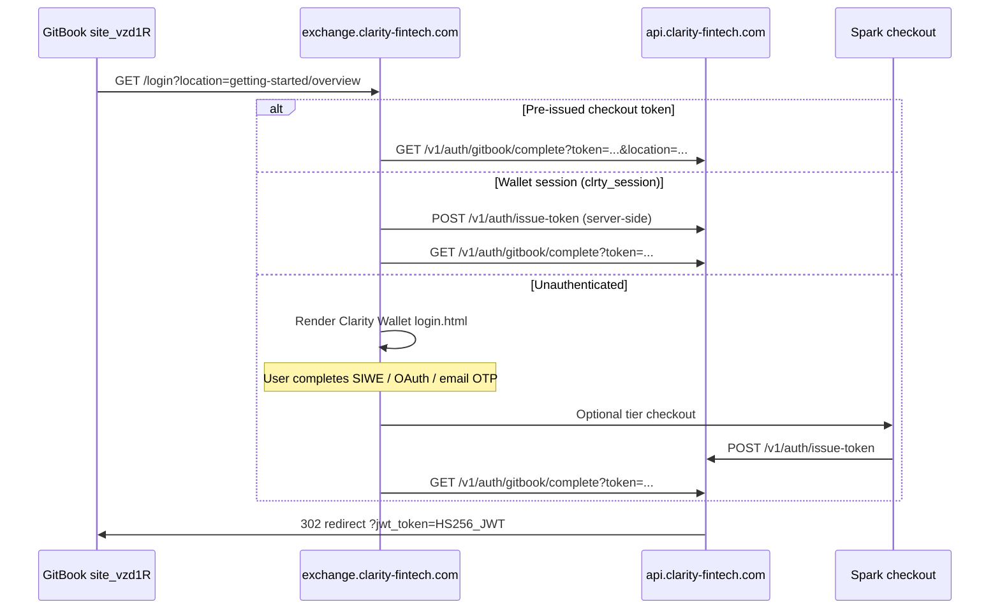

# GitBook Custom JWT Authentication Setup

Configure **Custom** visitor authentication for the SWARM Agent Node GitBook site (`site_vzd1R`).

## Dashboard checklist

Open [Audience settings](https://app.gitbook.com/o/6MCNfiz1cpjlR5LX4kWw/sites/site_vzd1R/settings/audience) and set:

| Field | Value |
|-------|-------|
| Authentication backend | **Custom** |
| Login URL | `https://exchange.clarity-fintech.com/login` |
| Logout URL | `https://exchange.clarity-fintech.com/logout` |
| Private signing key | Paste into Wrangler secret `GITBOOK_JWT_PRIVATE_KEY` — **never commit** |

Copy the **published site URL** from Audience → **Customize URL** → **Copy published link**, then set:

```bash
wrangler secret put GITBOOK_JWT_PRIVATE_KEY --env api-gateway
wrangler secret put GITBOOK_DOCS_PUBLISHED_URL --env api-gateway
# optional on fintauo for logout redirect target
wrangler secret put GITBOOK_DOCS_PUBLISHED_URL --env fintauo
```

## Algorithm

GitBook Custom auth requires **HS256** (HMAC-SHA256) with the symmetric private key from Audience settings. CLRTY uses the same HS256 path as `privateAccessJwt.js` — **not RS256** unless you migrate to a PEM key.

| Item | Value |
|------|-------|
| Algorithm | `HS256` |
| Query param on redirect | `jwt_token` |
| GitBook login callback param | `location` (page path inside docs) |
| Legacy CLRTY param | `redirect_url` (also accepted) |

## User flow



### Step-by-step

1. Visitor opens protected GitBook content → GitBook redirects to `https://exchange.clarity-fintech.com/login?location=<path>`.
2. **Fast path:** `?token=<private_access_jwt>` from Spark checkout → fintauo forwards to api-gateway complete → GitBook.
3. **Session path:** valid `clrty_session` cookie → fintauo issues private JWT server-side → complete → GitBook.
4. **Login path:** Clarity Wallet login shell; after auth, checkout funnel issues JWT via `POST /v1/auth/issue-token`.
5. api-gateway signs **GitBook visitor JWT** and redirects to `{GITBOOK_DOCS_PUBLISHED_URL}/{location}?jwt_token=...`.

## JWT visitor payload (adaptive content)

GitBook adaptive content reads claims from the signed JWT. CLRTY nests tier entitlements under `properties`:

```json
{
  "sub": "user@example.com",
  "email": "user@example.com",
  "name": "user",
  "properties": {
    "tier": "dev_portal",
    "tier_key": "dev_portal",
    "payment_rail": "card",
    "allowed_agents": ["*"],
    "node_access": "isolated_cherry_server",
    "gitbook_sections": [
      "dev-portal-upload",
      "agent-deployment-full",
      "instruction-book"
    ]
  },
  "iat": 1730000000,
  "exp": 1730007200
}
```

TTL default: **2 hours** (`GITBOOK_JWT_TTL_SECONDS` in `gitbookCustomAuth.js`).

## Tier → `properties.tier` mapping

From `swarmPaymentTierMatrix.js`:

| Spark checkout | `properties.tier` | Price | GitBook sections unlocked |
|----------------|-------------------|-------|---------------------------|
| `/uiquio/starter` | `starter` | $5.99/mo | starter-agents, agent-deployment-starter |
| `/uiquio/dev-portal` | `dev_portal` | $29/mo | dev-portal-upload, agent-deployment-full, instruction-book |
| `/uiquio/wallet-fund` | `wallet_fund` | $29 min | wallet-fund-execution, agent-deployment-dynamic |
| `/uiquio/elite` | `elite` | $149/mo | elite-helix, agent-deployment-helix |
| `/uiquio/enterprise` | `enterprise` | $499/mo | enterprise-bare-metal, agent-deployment-org |

Offer IDs (issue-token): `webb_starter_agents`, `dev_portal_execution_billing`, `clrty_pay_wallet_fund`, `uiquio_tier_elite`, `uiquio_tier_enterprise`.

## API endpoints

| Method | URL | Purpose |
|--------|-----|---------|
| GET | `https://api.clarity-fintech.com/v1/auth/gitbook/complete` | Browser redirect after auth |
| POST | `https://api.clarity-fintech.com/v1/auth/gitbook/issue` | JSON issue + `redirect_url` |
| GET | `https://api.clarity-fintech.com/v1/auth/gitbook/funnel` | Dashboard metadata (no secrets) |
| POST | `https://api.clarity-fintech.com/v1/auth/issue-token` | Post-checkout private JWT |
| POST | `https://api.clarity-fintech.com/v1/auth/verify` | Tier + section verify |

## Logout

| Surface | URL |
|---------|-----|
| Clarity logout | `https://exchange.clarity-fintech.com/logout` |
| GitBook visitor logout | `{GITBOOK_DOCS_PUBLISHED_URL}/~gitbook/auth/logout` |

`GET /logout` on exchange clears `clrty_session` and redirects to GitBook logout (or `?redirect_url=` override).

## Verify locally

```bash
bash scripts/verify_gitbook_auth_funnel.sh
```

## SSOT modules

| Module | Path |
|--------|------|
| GitBook auth SSOT | `cloudflare/spark-pay/shared/gitbookCustomAuth.js` |
| HS256 sign/verify | `cloudflare/spark-pay/shared/privateAccessJwt.js` |
| api-gateway handlers | `cloudflare/workers/api-gateway/src/gitbookCustomAuth.ts` |
| Exchange login gate | `external/clarity-fintech/fintauo/src/auth/gitbook_custom_auth.ts` |
| Client tier gating | `docs/gitbook/swarm-private-access/gitbook-gating.js` |

## Security

- **Never commit** `GITBOOK_JWT_PRIVATE_KEY` or paste it in docs/README.
- Set via `wrangler secret put GITBOOK_JWT_PRIVATE_KEY --env api-gateway`.
- Chain settlement remains **clrty-1 / 1202**; JWT `properties` carry tier entitlements only.

## Related

- [Pay-gated access](../getting-started/pay-gated-access.md)
- [GitBook Audience](https://app.gitbook.com/o/6MCNfiz1cpjlR5LX4kWw/sites/site_vzd1R/settings/audience)
- [GitBook custom backend docs](https://gitbook.com/docs/site-access/authenticated-access/setting-up-a-custom-backend)
